# Site Data Flow - UML Class Diagram

## Complete Flow Sequence
```
AMSP API → SiteService → Admin Portal → ProvisioningService → Admin Portal Table
```

## UML Class Diagram


## Visual Flow Diagram

```mermaid
flowchart TD
    %% Start
    Start([User Opens Admin Portal]) --> LoadSites[Load Sites List]
    
    %% AMSP API Flow
    LoadSites --> AMSPClient[AMSP Client]
    AMSPClient --> AMSPAPI[AMSP API<br/>/amsp/api/masterdata/v1/sites]
    AMSPAPI --> SitesData[Site Data<br/>id, name, city, clusterName, etc.]
    SitesData --> SiteService[Site Service]
    SiteService --> SiteController[Site Controller]
    SiteController --> AdminPortal[Admin Portal<br/>Display Sites Table/Dropdown]
    
    %% User Selection
    AdminPortal --> UserSelects{User Selects Site}
    UserSelects -->|Site Name| ProvisioningService[Provisioning Service]
    
    %% Provisioning API Flow
    ProvisioningService --> ValidateSite{Validate Site Name}
    ValidateSite -->|Valid| ProvisioningClient[Provisioning Client]
    ValidateSite -->|Invalid| ErrorHandler[Error Handler]
    
    ProvisioningClient --> ProvisioningAPI[Provisioning API<br/>/sps/v1/site?SiteName={siteName}]
    ProvisioningAPI --> APIResponse{API Response}
    
    %% Success Path
    APIResponse -->|Success 200| ProvisioningData[Provisioning Data<br/>Site, CM, Ranges, Extensions]
    ProvisioningData --> ProcessData[Process & Format Data]
    ProcessData --> DisplayDetails[Display Site Details<br/>in Admin Portal Table]
    DisplayDetails --> End([End])
    
    %% Error Paths
    APIResponse -->|400 Bad Request| Error400[400 Error Handler]
    APIResponse -->|404 Not Found| Error404[404 Error Handler]
    APIResponse -->|500 Server Error| Error500[500 Error Handler]
    
    Error400 --> ErrorHandler
    Error404 --> ErrorHandler
    Error500 --> ErrorHandler
    ErrorHandler --> ShowError[Show Error Message<br/>in Admin Portal]
    ShowError --> End
    
    %% Styling
    classDef apiBox fill:#e1f5fe,stroke:#01579b,stroke-width:2px
    classDef serviceBox fill:#f3e5f5,stroke:#4a148c,stroke-width:2px
    classDef controllerBox fill:#e8f5e8,stroke:#1b5e20,stroke-width:2px
    classDef dataBox fill:#fff3e0,stroke:#e65100,stroke-width:2px
    classDef errorBox fill:#ffebee,stroke:#c62828,stroke-width:2px
    classDef userBox fill:#f1f8e9,stroke:#33691e,stroke-width:2px
    
    class AMSPAPI,ProvisioningAPI apiBox
    class SiteService,ProvisioningService serviceBox
    class SiteController controllerBox
    class SitesData,ProvisioningData,ProcessData dataBox
    class ErrorHandler,Error400,Error404,Error500,ShowError errorBox
    class Start,End,AdminPortal,UserSelects,DisplayDetails userBox
```

## Detailed Component Flow Diagram

```mermaid
flowchart LR
    subgraph "External APIs"
        AMSP[AMSP API<br/>📡 Master Data]
        PROV[Provisioning API<br/>📡 Site Details]
    end
    
    subgraph "Backend Services"
        subgraph "API Clients"
            AMSPC[AMSP Client<br/>🔌 HTTP Client]
            PROVC[Provisioning Client<br/>🔌 HTTP Client]
        end
        
        subgraph "Business Logic"
            SS[Site Service<br/>⚙️ Business Logic]
            PS[Provisioning Service<br/>⚙️ Business Logic]
        end
        
        subgraph "Controllers"
            SC[Site Controller<br/>🎮 REST Endpoints]
        end
        
        subgraph "Error Handling"
            EH[Error Handler<br/>⚠️ Error Management]
        end
    end
    
    subgraph "Frontend"
        AP[Admin Portal<br/>🖥️ User Interface]
    end
    
    subgraph "Data Models"
        SITE[Site Model<br/>📋 id, name, city, etc.]
        PROVSITE[Provisioning Site<br/>📋 Site, CM, Ranges, Extensions]
        ERROR[Error Response<br/>📋 code, message, timestamp]
    end
    
    %% Flow connections
    AP -->|1. Request Sites| SC
    SC -->|2. Fetch Sites| SS
    SS -->|3. Call API| AMSPC
    AMSPC -->|4. HTTP GET| AMSP
    AMSP -->|5. Site Data| AMSPC
    AMSPC -->|6. Site Objects| SS
    SS -->|7. List<Site>| SC
    SC -->|8. JSON Response| AP
    
    AP -->|9. User Selects Site| SC
    SC -->|10. Get Details| PS
    PS -->|11. Call API| PROVC
    PROVC -->|12. HTTP GET| PROV
    PROV -->|13. Site Details| PROVC
    PROVC -->|14. Provisioning Data| PS
    PS -->|15. Processed Data| SC
    SC -->|16. Final Response| AP
    
    %% Error flows
    PROVC -.->|Error| EH
    PS -.->|Validation Error| EH
    EH -.->|Error Response| SC
    SC -.->|Error| AP
    
    %% Data model connections
    AMSPC -.->|Creates| SITE
    PROVC -.->|Creates| PROVSITE
    EH -.->|Creates| ERROR
    
    %% Styling
    classDef apiStyle fill:#e3f2fd,stroke:#1976d2,stroke-width:3px
    classDef serviceStyle fill:#f3e5f5,stroke:#7b1fa2,stroke-width:2px
    classDef controllerStyle fill:#e8f5e8,stroke:#388e3c,stroke-width:2px
    classDef dataStyle fill:#fff8e1,stroke:#f57c00,stroke-width:2px
    classDef errorStyle fill:#ffebee,stroke:#d32f2f,stroke-width:2px
    classDef frontendStyle fill:#f1f8e9,stroke:#689f38,stroke-width:3px
    
    class AMSP,PROV apiStyle
    class SS,PS,AMSPC,PROVC serviceStyle
    class SC controllerStyle
    class SITE,PROVSITE,ERROR dataStyle
    class EH errorStyle
    class AP frontendStyle
```



## Step-by-Step Process Flow


## API Endpoints

### AMSP API
- **Endpoint**: `/amsp/api/masterdata/v1/sites`
- **Method**: GET
- **Response**: Array of Site objects with fields: id, name, city, clusterName, status, siteCode, street, location, clusterId

### Provisioning Service API
- **Endpoint**: `/sps/v1/site?SiteName={SiteName}`
- **Method**: GET
- **Response**: ProvisioningSite object containing:
  - Site details
  - CM (Communication Manager) details
  - Ranges array with Type, Lowerbound, Upperbound, Prefix, AvailableExtensions
  - Extensions array with Type, Value, Status, Description

## Error Handling Strategy

1. **400 Bad Request**: Invalid siteName parameter
2. **404 Not Found**: Site not found in provisioning service
3. **500 Internal Server Error**: Server-side issues
4. **Network Errors**: Connection timeouts, DNS resolution failures
5. **Data Validation**: Invalid response format, missing required fields

## Key Design Patterns

1. **Service Layer Pattern**: Separation of business logic from controllers
2. **Client Pattern**: Dedicated clients for external API communication
3. **Error Handler Pattern**: Centralized error handling and response formatting
4. **DTO Pattern**: Data Transfer Objects for API communication
5. **Repository Pattern**: Data access abstraction (if database caching is needed)
